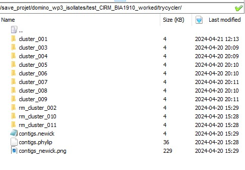

:::::::::::::::::::::::::::::::::::::: questions 

- How can we use Trycycler on the Migale cluster?

::::::::::::::::::::::::::::::::::::::::::::::::

::::::::::::::::::::::::::::::::::::: objectives

- Become familiar with the file structure and commands
- Understand the inputs and outputs to Trycycler Reconcile

::::::::::::::::::::::::::::::::::::::::::::::::

## Introduction

Short (Illumina NovaSeq) and long (ONT P2solo) read data has been generated for a selection of bacterial isolates. After quality control, Trycycler's "subsample" command was used to generate 3 subsamples of each readset at a minimum allowed read depth of 20x, and providing the expected genome size. Each subsample was then assembled by each assembler (Flye, Raven and Unicycler), generating a total of 9 assemblies. (One assembly was made for each (not-subsampled) readset using Canu - it wasn't included in the Trycycler clustering but could be useful later for troubleshooting more challenging assemblies).

Step 2 of Trycycler ([Clustering contigs](https://github.com/rrwick/Trycycler/wiki/Clustering-contigs)) has already been run, so let's take a look at our starting data.

```
 cd /save_projet/domino_wp3_isollates
```
Each sample directory should have a sub-directory containing the input assemblies,a sub-directory called 'trycycler' and a .fastq.gz containing the reads for that sample.

![Sample directory structure] (fig/folder1.jpg){alt='Sample directory structure'}

When we descend into the 'trycycler' folder we can see the output from Trycycler clustering, with one folder for each cluster, and .newick and .phylip files which contain information on the clustering of contigs (complete-linkage clustering based on Mash distance).

{alt='Trycyler directory structure'}

At the start, each cluster directory contains just one directory called "1_contigs" which contains the .fasta sequences of all contigs assigned to that cluster:

{alt='Cluster directory structure'}

::: callout
Trycycler renames contigs with letters ("A", "B", "C"...). to simplify the visualisation, but you can still identify which assembler produced each one. Contig names containing "Utg" were generated by Raven; Flye contigs contain "contig_X" where X is a number; Unicycler contigs simply contain "_X". 
:::

## Cluster assessment

While it is possible to run the next step (Reconciling contigs) automatically on all clusters, it is likely to fail on many clusters. This is the most manual part and subjective part of the Trycycler process, but will improve the quality of our final assemblies. 

The Trycycler wiki goes into greater detail on what to consider when evaluating clusters [here](https://github.com/rrwick/Trycycler/wiki/Clustering-contigs#choose-your-clusters). In an ideal world (!), sequencing an *E. coli* strain carrying one plasmid would produce two clusters: cluster_001 generally being the chromosomal cluster, and cluster_002 containing the plasmid contigs. 

Additionally, if all assemblers performed equally well on all read subsets, we would expect to see 9 contigs in cluster_001, each of which roughly in alignment with our expected genome size, and 9 contigs in cluster_002 with about the same length. This can happen on occasion, but more often you will need to intervene to exclude erroneous clusters. Start by checking the number of clusters Trycyler has found. 

A genome could have more than 10 valid clusters if it were carrying many plasmids, but generally >10 clusters indicates that either the sequencing wasn't deep enough, or that there was a lot of heterogeneity in the reads. Check the spreadsheet to see if there were a very low or high number of reads/bases generated for that sample. The mean/median read length is also important - too short reads will be unable to span repetitive regions and can cause fragmentation or misassembly. Ultimately, we won't be able to do much if the reads are too few/short, but if the sample was sequenced to very high depth, we might be able to generate better assemblies by subsetting further or trying a different assembler.

Next, view the tree. You can either copy and paste the .newick file into an in-browser tool like [ETEToolkit](http://etetoolkit.org/treeview/), or use the software installed on Migale with the supplied helper script in '/save_projet/domino_wp3_isollates/scripts/ete.py'
```python
from ete3 import Tree
import os
# Need to include this for Qt bug
os.environ['QT_QPA_PLATFORM']='offscreen'

# Read the tree
t = Tree('trycycler/contigs.newick')

# Render the tree to a PNG file
t.render("contigs_newick.png")
```
You can execute this in the sample directory with this command:
```
qsub -cwd -V -N tree_view -o /out/tree_view -e /err/tree_view -b y "conda activate ete3-3.1.3 && python3 ../../ete.py && conda deactivate"
```
It should produce "contigs_newick.png", which you can then open and view. 
{alt='Contigs_newick png generated with ETEToolkit'}

To remove a cluster, you can simply rename the folder e.g. to rm_cluster_002 (or bad_cluster_002 - it doesn't matter once the directory name does not commence with "cluster_". This keeps the sequences, in case we want to revisit the decision later on.

{alt='Marking a "bad" cluster'}

::::::::::::::::::::::::::::::::::::: challenge

## Semi-automation

If you can, make a quick note of why you decided to exclude/include clusters on the recording sheet.

:::::::::::::::: solution

It is unlikely that Trycycler can be fully automated, but we could consider writing rules to automate the discarding of obvious poor clusters, e.g.

* if the number of contigs in a cluster is <2, discard
* if a cluster is highly-related to a chromomosomal cluster and contains <2, discard
* when is it worth keeping "fragments" which could describe true [structural heterogeneity](https://www.ncbi.nlm.nih.gov/pmc/articles/PMC9980784/) e.g. (pro)phage, *fim* switches?
* etc!

:::::::::::::::::::::::::
:::::::::::::::::::::::::::::::::::::::::::::::

## Trycycler Reconcile


[r-markdown]: https://rmarkdown.rstudio.com/
