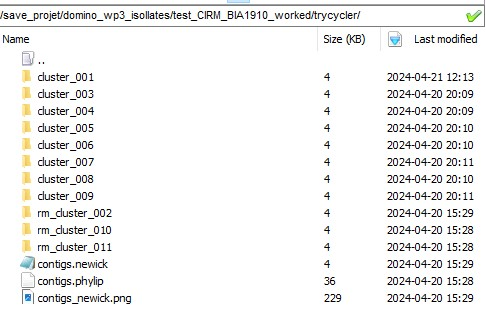

:::::::::::::::::::::::::::::::::::::: questions 

- What happens next to "good" clusters we identified?

::::::::::::::::::::::::::::::::::::::::::::::::

::::::::::::::::::::::::::::::::::::: objectives

- Understand how and why to exclude a contig from a cluster
- Be able to manually repair duplicated contigs

::::::::::::::::::::::::::::::::::::::::::::::::

## Introduction

In the previous step we identified clusters of contigs, which could each represent true replicons present in our isolates. However, they were primarily clustered using Mash distance and before alignment, they need to be standardised in terms of length, similarity and orientation. We will use Trycycler's 'reconcile' function to achieve this.
([Reconciling contigs](https://github.com/rrwick/Trycycler/wiki/Reconciling-contigs)). Additionally, as most (but not all!) bacterial replicons are circular, Trycycler will try to cleanly circularise each contig using the other other contigs in the cluster as a reference: for more information, see: [Trycycler wiki: How circularisation repair works](https://github.com/rrwick/Trycycler/wiki/How-circularisation-repair-works).

{alt='Trycycler folder after clusters have been manually assessed'}

## Running Trycycler Reconcile

The basic command to reconcile a cluster looks like this:
```
trycycler reconcile --reads *.fastq.gz --cluster_dir trycycler/cluster_001 
```
and we could submit this as a cluster job using the following command (changing the number of the cluster each time for the stderr, stdout and --cluster_dir parameters):
```
qsub -cwd -V -N tr_test -e err/try_rec_001 -o out/try_rec_001 -pe thread 4 -b y "conda activate trycycler-0.5.4 && trycycler reconcile --reads *.fastq.gz --cluster_dir trycycler/cluster_001 --threads 4 && conda deactivate"
qsub -cwd -V -N tr_test -e err/try_rec_002 -o out/try_rec_002 -pe thread 4 -b y "conda activate trycycler-0.5.4 && trycycler reconcile --reads *.fastq.gz --cluster_dir trycycler/cluster_002 --threads 4 && conda deactivate"
```
However, for simplicity, a bash script is provided which will detect the clusters present, and generate and submit a script to run Trycycler reconcile on each. You can run it like this, with no arguments (in the main isolate directory):
```
/save_projet/domino_wp3_isollates/scripts/reconcile.sh
```
If Trycycler was able to reconcile a cluster automatically, a new file '2_all_seqs.fasta' will be generated in the cluster directory, containing the reconciled contigs. Frequently, it will fail to produce output, meaning that manual intervention is required to resolve. The error file (written to err/try_rec_{clusternumber}) will guide your next course of action.

## Manual interventions

Reconciliation can fail for many reasons [Reconciling contigs - manualintervention](https://github.com/rrwick/Trycycler/wiki/Reconciling-contigs#manual-intervention).

Most commonly, one or more contigs in a cluster will be too long or short. Mash distance greater than the default threshold (0.01) can also prevent the reconciliation from finishing. Like we saw before with the cluster folders, we can exclude a contig by renaming its extension from 'contig.fasta' to 'contig.bad', or similiar. You can then rerun Trycycler reconcile on just that cluster:
```
qsub -cwd -V -N tr_test -e err/try_rec_001 -o out/try_rec_001 -pe thread 4 -b y "conda activate trycycler-0.5.4 && trycycler reconcile --reads *.fastq.gz --cluster_dir trycycler/cluster_001 --threads 4 && conda deactivate"
```
If we are left with very few contigs in a cluster (e.g. <3) then it will probably be worth making more assemblies before proceeding further - as we started with 9 assemblies, we have some leeway.

## Manual repair of overlap

You may encounter a cluster with a contig that is longer than the others, preventing reconciliation. This can indicate an assembly error and is particularly common with plasmids, which can be double or even tripled in length. We can manually remove the (presumed) duplicate sequence in a text editor: [Trycycler Wiki: Manually fixing overlap](https://github.com/rrwick/Trycycler/wiki/FAQ-and-miscellaneous-tips#manually-fixing-overlap).

## Linear plasmids/phage

Phage genomes can adopt linear conformations. Linear plasmids have also been described in some bacteria in the order 'Enterobacterales' e.g. *Klebsiella*, *Salmonella*. If you have have a suspicious cluster of small contigs that will not circularise, you could try to [Blast](https://www.ncbi.nlm.nih.gov/geo/query/blast.html) one of the sequences and see the closest hits. More frequently, such clusters tend to represent chromosomal fragments e.g. prophage, which one or more assemblers excluded from the main chromosome.

## Modifying the parameters for Trycycler reconcile

The default parameters of the 'reconcile' function work well for most cases, and it is likely preferrable to exclude a handful of contigs first. In certain scenarios, you may wish to amend the [thresholds](https://github.com/rrwick/Trycycler/wiki/Reconciling-contigs#settings), particularly '--max_length_diff', '--max_add_seq', '--max_add_seq_percent','--max_trim_seq' and '--max_trim_seq_percent'. You can add the flags to your 'qsub' submission command.

[r-markdown]: https://rmarkdown.rstudio.com/
