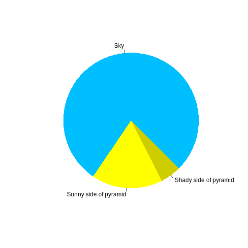

:::::::::::::::::::::::::::::::::::::: questions 

- Why go to the bother of using Trycycler to assemble bacterial genomes?

::::::::::::::::::::::::::::::::::::::::::::::::

::::::::::::::::::::::::::::::::::::: objectives

- Provide examples of errors that can occur during assembly
- Explain the approach used by Trycycler

::::::::::::::::::::::::::::::::::::::::::::::::

## Introduction

Bacterial genomes are extremely dynamic, undergoing frequent loss and gain of both chromosomal and extrachromosomal elements [1] including:
* insertion sequences
* rep sequences
* ICE elements
* plasmids

This can be particularly interesting to food microbiologists in the context of adaptations to dynamic niches during food fermentations. In order to detect and characterise this kind of genomic plasticity, we require high quality bacterial genome assemblies which are both:

* Complete - fully contiguous
* Accurate - fully match the actual DNA sequence of the organism

Short-read sequencing (e.g. Illumina) provides high-quality reads which provide for accurate assemblies. The short length of reads (100-300bp) impedes assembly however, particularly at repetitive regions. This results in fragmented draft assemblies split up into several contigs. Furthermore, dynamic genome elements (such as ICE elements, IS) are often themselves repetitive, meaning that their true biological presence is not reflected in the draft assembly.

 1. `questions` are displayed at the beginning of the episode to prime the
    learner for the content.
 2. `objectives` are the learning objectives for an episode displayed with
    the questions.
 3. `keypoints` are displayed at the end of the episode to reinforce the
    objectives.

:::::::::::::::::::::::::::::::::::::::::::::::::::::::::::::::::::: instructor

Inline instructor notes can help inform instructors of timing challenges
associated with the lessons. They appear in the "Instructor View"

::::::::::::::::::::::::::::::::::::::::::::::::::::::::::::::::::::::::::::::::

::::::::::::::::::::::::::::::::::::: challenge 

## Insertion sequences

Insertion sequences are short genomic elements which are frequently found in bacterial genomes. They can shape genomes by moving around, with the potential to generate deletions and influence gene expression levels.

:::::::::::::::::::::::: solution 

## Output
 
```output
[1] "This new lesson looks good"
```

:::::::::::::::::::::::::::::::::


## Challenge 2: how do you nest solutions within challenge blocks?

:::::::::::::::::::::::: solution 

You can add a line with at least three colons and a `solution` tag.

:::::::::::::::::::::::::::::::::
::::::::::::::::::::::::::::::::::::::::::::::::

## Figures

You can also include figures generated from R Markdown:


```r
pie(
  c(Sky = 78, "Sunny side of pyramid" = 17, "Shady side of pyramid" = 5), 
  init.angle = 315, 
  col = c("deepskyblue", "yellow", "yellow3"), 
  border = FALSE
)
```

<div class="figure" style="text-align: center">

<p class="caption">Sun arise each and every morning</p>
</div>

Or you can use standard markdown for static figures with the following syntax:

`{alt='alt text for
accessibility purposes'}`

{alt='Insertion Sequences'}

::::::::::::::::::::::::::::::::::::: callout

Callout sections can highlight information.

They are sometimes used to emphasise particularly important points
but are also used in some lessons to present "asides": 
content that is not central to the narrative of the lesson,
e.g. by providing the answer to a commonly-asked question.

::::::::::::::::::::::::::::::::::::::::::::::::


## Math

One of our episodes contains $\LaTeX$ equations when describing how to create
dynamic reports with {knitr}, so we now use mathjax to describe this:

`$\alpha = \dfrac{1}{(1 - \beta)^2}$` becomes: $\alpha = \dfrac{1}{(1 - \beta)^2}$

Cool, right?

::::::::::::::::::::::::::::::::::::: keypoints 

- Use `.md` files for episodes when you want static content
- Use `.Rmd` files for episodes when you need to generate output
- Run `sandpaper::check_lesson()` to identify any issues with your lesson
- Run `sandpaper::build_lesson()` to preview your lesson locally

::::::::::::::::::::::::::::::::::::::::::::::::

[r-markdown]: https://rmarkdown.rstudio.com/
